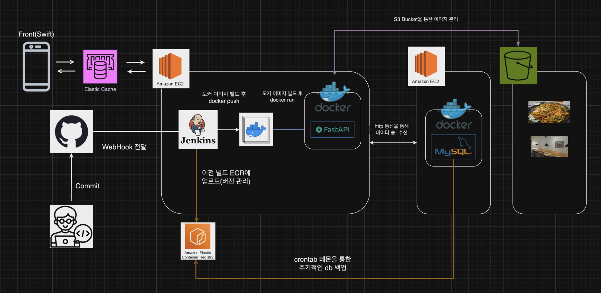
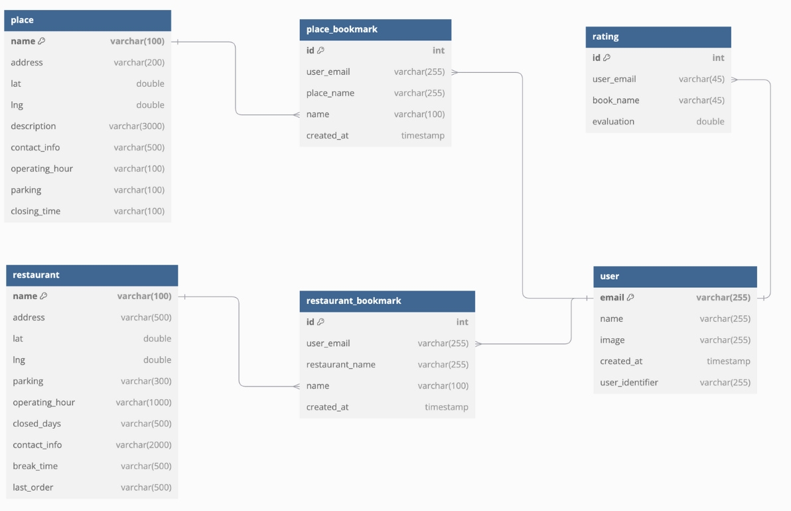

# 💘 DateSpot
데이트 장소를 추천하고 즐겨찾기로 관리하는 iOS 앱입니다.  
SwiftUI로 화면을 만들고 FastAPI 백엔드와 직접 연동해 **로그인 · 북마크 · 사용자 관리** 흐름을 구현했습니다.  

---

## 📽️ 데모 영상
> 실제 앱 사용 흐름이 궁금하다면 아래 링크를 클릭하세요  
[👉 유튜브 시연 영상 보러가기](https://www.youtube.com/watch?v=HX3CKYLh1qs)

---

## 🧩 프로젝트 개요
- SwiftUI 기반 iOS 프론트엔드와 FastAPI 서버를 연동해 **로그인/북마크/사용자 관리** 기능을 제공
- S3 이미지 저장, Redis 캐시, Jenkins 자동 배포 등 **인프라** 구성
- 짧은 기간에도 핵심 사용자 가치를 빠르게 전달하도록 **단순·명확한 화면 흐름** 설계

---

## 👨‍💻 맡은 역할

| 분야 | 주요 내용 |
|---|---|
| 프론트엔드 | 로그인, 북마크, 마이페이지 화면 개발 / 테마 유지(Realm) |
| 백엔드 연동 | FastAPI 인증·북마크 API 연동 / 요청·응답 스키마 맞춤 / 에러 메시지 매핑 |
| 인프라 협업 | S3 이미지 연동 / Redis 캐시 서버 구성 / Jenkins 파이프라인 참여 |

---

## 🛠 기술 스택

**iOS / Frontend**  

**Backend**  

**Database / Local**  

**Infra**  

**Tools**  

---

## 🌟 주요 기능

| 기능 | 설명 |
|---|---|
| 소셜 로그인 | Google, Apple OAuth / 인증 완료 후 자동 로그인 유지(Realm) |
| 북마크 | 맛집·명소 즐겨찾기 추가/삭제 / 사용자별 상태 서버 저장 |
| 마이페이지 | 이메일 기반 프로필 조회 / 로그아웃 / 계정 탈퇴 / 테마 유지 |
| 성능/UX | 비동기 로딩·오류·빈 상태 분리 / 사용자 액션 즉시 반영 피드백 |

---

## 🖥️ 시스템 아키텍처
iOS(SwiftUI) → FastAPI(EC2) → MySQL  
이미지: S3 저장 / 캐시: Redis(Elasticache) / 배포: Jenkins 자동화

---

## 🗂 ERD

---

## 🧠 트러블슈팅 (문제 → 원인 → 해결 → 결과)

1) S3 이미지 로딩 실패  
- 문제: 이미지를 정상 업로드했지만 앱에서 로딩 실패  
- 원인: 파일명이 Unicode 정규화(NFD)로 저장되어 요청 키와 불일치  
- 해결: 서버에서 조회 시 이름을 NFD로 정규화하여 일치시키도록 수정  
- 결과: 이미지 정상 로딩

2) 소셜 로그인 OAuth 인증 타이밍 이슈  
- 문제: 인증 완료 전에 토큰을 서버로 전송해 실패  
- 원인: SwiftUI 비동기 처리 순서 불일치  
- 해결: 인증 완료 보장 후 메인 스레드에서 API 호출하도록 구조 정리  
- 결과: 로그인 성공률 안정화, 초기 이탈 감소

3) Redis 캐시 서버 통신 실패  
- 문제: FastAPI와 Elasticache Redis 간 연결 실패  
- 원인: VPC 보안 그룹에서 6379 포트 차단  
- 해결: 인바운드 규칙 수정으로 6379 허용  
- 결과: 캐시 적용 정상화, 반복 조회 응답 개선

---

## 💬 느낀 점
한정된 기간 안에서도, 많이 만들기보다 **자주 쓰는 흐름을 깊게 다듬는 것**이 더 큰 가치를 준다고 느꼈습니다.  
SwiftUI와 서버 연동을 함께 다루며 화면·상태·네트워크를 하나의 사용자 경험으로 묶는 감각을 키웠습니다.

---

## 📌 GitHub Repo
[DateSpot Repository](https://github.com/donghun-ha/DateSpot_APP)
